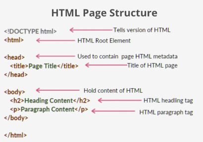
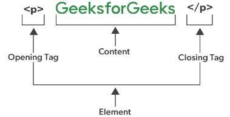
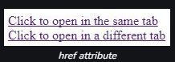
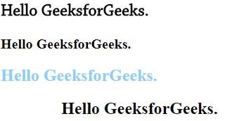

- [HTML Basic](#html-basic)
  - [What is HTML ?](#what-is-html-)
  - [Why to learn HTML ?](#why-to-learn-html-)
  - [Features of HTML](#features-of-html)
  - [HTML Page structure](#html-page-structure)
  - [HTML Comments](#html-comments)
    - [Single line comment](#single-line-comment)
    - [Multi-line comment](#multi-line-comment)
- [HTML Elements](#html-elements)
  - [Nested elements](#nested-elements)
  - [Empty elements](#empty-elements)
- [Attributes](#attributes)
  - [HTML src attribute](#html-src-attribute)
  - [HTML alt attribute](#html-alt-attribute)
  - [HTML width and height attribute](#html-width-and-height-attribute)
  - [HTML ID attribute](#html-id-attribute)
  - [HTML href attribute](#html-href-attribute)
  - [HTML style attribute](#html-style-attribute)
- [HTML heading](#html-heading)
  - [Horizontal rules (\< hr\>tag)](#horizontal-rules--hrtag)
- [HTML Paragraphs](#html-paragraphs)
  - [HTML **\< br\>** tag](#html--br-tag)
- [HTML Text formating](#html-text-formating)
  - [Formating elements](#formating-elements)
- [HTML Colors](#html-colors)
  - [HTML Color usage](#html-color-usage)
  - [HTML Colors Example Explanation:](#html-colors-example-explanation)
  - [Color Value](#color-value)
    - [RGB Color value](#rgb-color-value)
    - [RGBA Color value](#rgba-color-value)
  - [HEX Color Value](#hex-color-value)
- [HTML Links](#html-links)
  - [Using image as link in html](#using-image-as-link-in-html)
  - [Creating a download link in HTML](#creating-a-download-link-in-html)
- [HTML image](#html-image)


# HTML Basic

## What is HTML ?
  - HTML stands for `HyperText Markup Language.` It is the standard language used to create and design web pages on the internet.
  - HTML is a combination of Hypertext and Markup language. Hypertext defines the link between the web pages and markup language defines the text document within the tag.

<p align="right">(<a href="#top">˄</a>)</p>  

## Why to learn HTML ?
  - HTML is used to create the structure of web pages and websites that are displayed on the Internet. It contains Tags and Attributes that are used to design the web pages. Also, we can link multiple pages using Hyperlinks.  

<p align="right">(<a href="#top">˄</a>)</p>

## Features of HTML
  - It is easy to learn and easy to use.
  - It is platform-independent.
  - Images, videos, and audio can be added to a web page.
  - Hypertext can be added to the text.
  - It is a markup language. 

<p align="right">(<a href="#top">˄</a>)</p>

## HTML Page structure
  

   - **< !DOCTYPE html>** – This is the document type declaration (not technically a tag). It declares a document as being an HTML document. The doctype declaration is not case-sensitive. 
  
   - **< html>** – This is called the HTML root element. All other elements are contained within it.
  
   - **< head>** – The head tag contains the “behind the scenes” elements for a webpage. Elements within the head aren’t visible on the front end of a webpage. HTML elements used inside the `< head>` element include: 
  
   - **< style>** – This HTML tag allows us to insert styling into our web pages and make them appealing to look at with the help of CSS.
  
   - **< title>** – The title is what is displayed on the top of your browser when you visit a website and contains the title of the webpage that you are viewing.
  
   - **< base>** – It specifies the base URL for all relative URL’s in a document.
  
   - **< noscript>** – Defines a section of HTML that is inserted when the scripting has been turned off in the user’s browser.
  
   - **< script>** – This tag is used to add functionality to the website with the help of JavaScript.
  
   - **< meta>** – This tag encloses the metadata of the website that must be loaded every time the website is visited. For eg:- the metadata charset allows you to use the standard UTF-8 encoding on your website. This in turn allows the users to view your webpage in the language of their choice. It is a self-closing tag.
  
   - **< link>** – The ‘link’ tag is used to tie together HTML, CSS, and JavaScript. It is self-closing.
  
   - **< body>** – The body tag is used to enclose all the visible content of a webpage. In other words, the body content is what the browser will show on the front end.  
  
<p align="right">(<a href="#top">˄</a>)</p>

## HTML Comments
   - HTML Comments are used to insert comments in the HTML code. It is a good practice of coding so that the coder and the reader can get help to understand the code. It is a simple piece of code that is wiped off (ignored) by web browsers i.e., not displayed by the browser.

### Single line comment
 -  The single-line comment is given inside the ( <!–  comment –> ) tag. 
 -  **Syntax**
```html
    <!--  comment -->
```    
   -  **Example**
```html
   <!DOCTYPE html>
   <html>

   <body>
	     <!--This is heading Tag, It wont be
        displayed by the browser -->
	<h1>This is heading </h1>

	    <!--This is single line comment,It wont be
       displayed by the browser -->
	<h2>This is single line comment</h2>

  </body>

  </html>
```  
### Multi-line comment
  - Multiple lines can be given by the syntax (<!– –>), Basically it’s the same as we used in single line comment, difference is half part of the comment (” –> “), is appended where the intended comment line ends. 
  
- **Syntax**
```html
    <!--  Multi
    Line 
    Comment -->
```
- **Example**
```html
   <!DOCTYPE html>
<html>

<body>

	<!-- This is 
		heading tag -->
	<h1>This is Heading</h1>

	<!-- This is
		multi-line
		comment -->
	<h2>This is multi-line comment</h2>

</body>

</html>
```
<p align="right">(<a href="#top">˄</a>)</p>

# <h2>HTML Elements</h2>
  
  

  - An HTML element is a collection of start and end tags with the content inserted in between them. HTML elements are building blocks of web pages, representing different types of content such as headings, paragraphs, links, and images.
  - **Syntax**
```html
   <tagname> Contents... </tagname>
```   
## Nested elements
  - The HTML element used inside another HTML Element is called a nested HTML element.

## Empty elements 
  - HTML Elements without any content i.e., that do not print anything are called Empty elements. Empty HTML elements do not have an ending tag. For instance.`< br>`, `< hr>`, `< link>`, `< input>` etc are HTML elements.
  
<p align="right">(<a href="#top">˄</a>)</p>

# Attributes
 - All HTML elements have attributes that will provide additional information about that particular element. It takes two parameters, ie, a name & a value which define the properties of the element and are placed inside the element tag.
 - Attributes are always added to the start tag of an HTML element. Attributes always come in name/value pairs like this: attribute_name=”value” and attribute values should always be enclosed in quotes
 - **Syntax**
```html
   <element attribute_name="attribute_value">
```
<p align="right">(<a href="#top">˄</a>)</p>

## HTML src attribute
  - If we want to insert an image into a webpage, then we need to use the `< img>` tag and the src attribute. We will need to specify the address of the image as the attribute’s value inside the double quote.
  - **Example**
```html
   <html>
  <head>
    <title>src Attribute</title>
  </head>
  <body>
    
     <!-- insert image-->
  </body>
  </html>
```
<p align="right">(<a href="#top">˄</a>)</p>

## HTML alt attribute
  - This is an alternate tag that is used to show or display something if the primary attribute i.e., the `< img>` tag, fails to display the value assigned to it. This can also be used to describe the image to a developer who is actually sitting at the coding end.
```html
    <!--If the image is not found or the img field 
     is left blank the alt value gets displayed-->
```
<p align="right">(<a href="#top">˄</a>)</p>

## HTML width and height attribute
  - This attribute is used to adjust the width and height of an image.
  - **Example**
```html
   <html>
  <head>
    <title>Width and Height</title>
  </head>
  <body>
    
      <!-- for image size and height -->
  </body>
  </html>
```  
<p align="right">(<a href="#top">˄</a>)</p>

## HTML ID attribute
  - This attribute is used to provide a unique identification to an element. Situations may arise when we will need to access a particular element that may have a similar name as the others. In that case, we provide different id’s to various elements so that they can be uniquely accessed. 
  - **Example**
```html
   <!DOCTYPE html>
  <html>

  <head>
    <style>
    #geeks {
      color: green;
    }
    </style>
  </head>

  <body>
    <h1 id="geeks">Welcome to GeeksforGeeks</h1> </body>

  </html>
```
<p align="right">(<a href="#top">˄</a>)</p>

## HTML href attribute
  - This attribute is used to specify a link to any address. This attribute is used along with the `< a>` tag. The link put inside the href attribute gets linked to the text displayed inside the `< a>` tag. On clicking on the text we will be redirected to the link. By default, the link gets opened in the same tag but by using the target attribute and setting its value to `“_blank” `, we will be redirected to another tab or another window based on the browser’s configuration.
  - **Example**
```html
<html>
<head>
	<title>link Attribute</title>
</head>
<body>
	<a href="https://www.geeksforgeeks.org/">
		<!--Click to open in the same tab-->
	</a><br>
	<a href="https://www.geeksforgeeks.org/" target="_blank">
		<!--Click to open in a different tab-->
	</a>
</body>
</html>
```
- **Output**
  
   
<p align="right">(<a href="#top">˄</a>)</p>

## HTML style attribute
  - This attribute is used to provide various CSS effects to the HTML elements such as increasing font-size, changing font-family, coloring, etc.
  - The style attribute specifies an inline style for an element. The style attribute will override any style set globally, e.g. styles specified in the `< style>` tag or in an external style sheet.
  ```html
<html>
<head>
	<title>style Attribute</title>
</head>
<body>
	<h2 style="font-family:Chaparral Pro Light;">Hello GeeksforGeeks.</h2>
	<h3 style="font-size:20px;">Hello GeeksforGeeks.</h3>
	<h2 style="color:#8CCEF9;">Hello GeeksforGeeks.</h2>
	<h2 style="text-align:center;">Hello GeeksforGeeks.</h2>
</body>
</html>
  ```
*output* :



<p align="right">(<a href="#top">˄</a>)</p>

# HTML heading
 - The HTML heading tag is used to define the headings of a page. There are six levels of headings defined by HTML. These 6 heading elements are h1, h2, h3, h4, h5, and h6; with h1 being the highest level and h6 being the least.
   * `< h1>` is used for the main heading. (Biggest in size)
   * `< h2>` is used for subheadings, if there are further sections under the subheadings then the `< h3>` elements are used. 
   * `< h6>` for the small heading (smallest one).
- **Syntax**
  ```html
  <!-- the 'h' inside the tag should be in small case only.-->
  <h1>Heading1</h1>
  <h2>Heading2</h2>
  .
  .
  .
  <h6>Heading6</h6>
  ```
  <p align="right">(<a href="#top">˄</a>)</p>

## Horizontal rules (< hr>tag)
 - The `< hr>` tag which stands for the horizontal rule is used to define a thematic break in an HTML page. The `< hr>` tag is an empty tag, and it does not require any end tag. It is basically used to separate content. Please refer to the HTML `< hr>` Tag article for more detailed information.
- **Example**
  ```html
  <!DOCTYPE html>
  <html>

   <body>
	   <h1>Heading 1</h1>
	    <p>I like HTML.</p>
	     <!-- hr Tag is used here-->
	   <hr />
	   <h2>Heading 2</h2>
	    <p>I like CSS.</>
	     <!-- hr Tag is used here-->
	   <hr />
	   <h2>Heading 3</h2>
	    <p>I like Javascript.</p>
   </body>

  </html>
  ```
<p align="right">(<a href="#top">˄</a>)</p>

# HTML Paragraphs
 - The `< p>` tag in HTML defines a paragraph. These have both opening and closing tags. So anything mentioned within `< p>` and `< /p>` is treated as a paragraph.
 -  A paragraph is a block-level element so a new paragraph always begins on a new line, and browsers naturally put some space before and after a paragraph to make it look neat and easy to read.

 - **Syntax** 
  ```html
     <p> Content </p>
  ``` 
  <p align="right">(<a href="#top">˄</a>)</p>

 ## HTML **< br>** tag
  - The HTML `< br>` tag element creates a line break, giving you a new line without starting a new paragraph. Use `< br>` when you want to move to the next line without beginning a whole new paragraph.   
 - **Syntax**
    ```html
        <br>
    ```
<p align="right">(<a href="#top">˄</a>)</p>

# HTML Text formating
 - HTML Text Formatting provides various tags for text formatting to enhance the visual presentation of content on a webpage. You can make your text bold, italic, etc. by using some HTML tags.   
        
## Formating elements 
 - Tag `<i>` - Showcases italicized text.
 - Tag `<small>` - Renders text in a smaller font size.
 - Tag `<ins>` - Highlights added or inserted text.
 - Tag `<sub>` - Creates subscript text.
 - Tag `<strong>` - Emphasizes text with importance, often in bold.
 - Tag `<b>` - Displays text in a bold format.
 - Tag `<mark>` - Accentuates text with a background highlight.
 - Tag `<del>` - Strikes through text to signify deletion. 
 - Tag `<em>` - Adds emphasis to text, commonly styled as italic.
 - Tag `<sup>` - Formats text as superscript.   

<p align="right">(<a href="#top">˄</a>)</p>

# HTML Colors
 - HTML Colors can be applied to text, backgrounds, borders, links, forms, tables, etc., They can be defined using various formats, such as hexadecimal, RGB, RGBA, HSL, and named colors, allowing for precise control of color presentation on web pages.

## HTML Color usage
 - **Usage** - `Background color`
   * **Descriptions** - HTML Background Color is the shade that appears behind the content on a webpage. The background covers the total size of the element with padding and border but excludes the margin. It makes the text so easy to read for the user. 
   * **Syntax** 
    ```html
       <div style=”background-color: magenta;”>
      Div with magenta background
      </div>
    ```
<hr>

- **Usage** - `Text Color`      
    * **Description** - Text color in HTML specifies the color of the text content, similar to font color.
    * **Syntax**
   ```html
      <p style=”color: pink;”>
      Pink color is used
      </p>
   ```
<hr> 

- **Usage** - ``Border Color``
   * **Description** - HTML Border Color refers to the color of borders around elements like `<div>`, ``, etc. It defines the color of the border lines.
   * **Syntax**
  ```html
     <div style=”border: 1px solid black; border-color: green;”>
    This div has a green border
    </div>
  ```
<hr>

- **Usage** - `Link Color`
    * **Description** - HTML Link Color specifies the color of the anchor tag within a webpage, allowing us to define the color of clickable text, and making user navigation more visual.
    * **Syntax**
  ```html
     <a href=”#” style=”color: blue;”>
      Link has a blue color
     </a>
  ```
<hr>     

<p align="right">(<a href="#top">˄</a>)</p>

## HTML Colors Example Explanation:
 - In this example we create HTML to structure content with elements like headings, div, links, and paragraphs.
 - Heading displays a gray background for emphasis.
 - Div is bordered with skyblue color for visual distinction.
 - Link text appears in tomato color for better visibility.
 - Paragraph text is styled with a dark green color for readability.
## Color Value
 - Color values in HTML define the color of elements. They can be specified using various formats such as hexadecimal, RGB, RGBA, HSL, HSLA, color names, and system color keywords.
### RGB Color value
 - RGB, which stands for Red, Green, and Blue, is a method used in CSS to describe colors. It works by mixing different amounts of three primary colors, each with values ranging from 0 to 255. By adjusting these values, we can produce an extensive range of colors, allowing for the creation of diverse and better color palettes across websites. 
 - **Syntax**
   ```html
    // Blue background
   <p style="background-color: rgb(0, 0, 255);">
    Is the sky background Blue by using RGB
   </p>
   ```
 ### RGBA Color value
  - RGBA (Red, Green, Blue, Alpha) is a color model similar to RGB, but with an added alpha parameter representing transparency. The alpha value, which ranges from 0 to 1, adjusts transparency, allowing the display of colors with varying levels of opacity. It’s representation is as rgba(red, green, blue, alpha).
  - **Syntax**
    ```html
     // Semi-transparent text with a purple hue
    <span style="color: rgba(128, 0, 128, 0.5);">
    This text is semi-transparent with a purple hue using RGBA
    </span>
    ```
## HEX Color Value
 - Hexadecimal color values, often referred to as hex values, use a six-digit code made up of pairs of characters.
 - **Syntax**
   ```html
     // Pinkish Background
    <div style="background-color: #FF69B4;">
    div has a pinkish background by using Hex
    </div>    
   ```  
<p align="right">(<a href="#top">˄</a>)</p>

# HTML Links
 - HTML Links are connections from one web resource to another. A link has two ends, An anchor and a direction. The link starts at the “source” anchor and points to the “destination” anchor, which may be any Web resource such as an image, a video clip, a sound bite, a program, an HTML document or an element within an HTML document.
 - **Syntax**
   ```html
     <a href="url">link text</a>
   ```
- **External link**
  - An external link is a type of hyperlink that directs users to a resource, such as a webpage, image, or document, located on a different website or domain.
- **Internal link**
   - An internal link is a type of hyperlink whose target or destination is a resource, such as an image or document, on the same website or domain.    
## Using image as link in html
 - An image can be used to create a link to a specified URL. When the viewer clicks on the link, it redirects them to another page.
   ```html
      <a href="url">
      
      </a> 
   ```    
## Creating a download link in HTML
 - A text link of a pdf, doc or zip file can be created to make it downloadable.
 - **Example**
  ```html
     <!DOCTYPE html>
      <html>

      <h3>Creating a download link</h3>

      <body>
        <a href="GeeksforGeeks.pdf">
          Download PDF File
        </a>
      </body>

      </html>
  ```    
  <p align="right">(<a href="#top">˄</a>)</p>

# HTML image
 - Adding images on a webpage: The `` tag is used to add or embed the images to a webpage/website. The “img” tag is an empty tag, which means it can contain only a list of attributes and it has no closing tag. The addition of the images improves the quality along with enhancing the design structure, appearance of the webpage.   
  - **Syntax**
  ```html
     
  ```
- *Attribute: The `` tag has following attributes:*  

  * `src` : It is used to specify the path to the image. 
  
  * `alt` : It is used to specify an alternate text for the image. It is useful as it informs the user about what the image means and also due to any network issue if the image cannot be displayed then this alternate text will be displayed.  
  
  * `crossorigin` : It is used to import images from third-party sites that allow cross-origin access to be used with canvas.
  
  * `height` : It is used to specify the height of the image.
  
  * `width` : It is used to specify the width of the image.
  
  * `ismap` : It is used to specify an image as a server-side image map.
  
  * `loading` : It is used to specify whether a browser should defer the loading of images until some conditions are met or load an image immediately.
  
  * `longdesc` : It is used to specify a URL to a detailed description of an image.
  
  * `referrerpolicy` : It is used to specify which referrer information to use when fetching an image i.e. no-referrer, no-referrer-when-downgrade, origin, origin-when-cross-origin, unsafe-url.
  
  * `sizes` : It is used to specify image sizes for different page layouts.
  
  * `srcset` : It is used to specify a list of image files to use in different situations.
  
  * `usemap` : It is used to specify an image as a client-side image map.

<p align="right">(<a href="#top">˄</a>)</p>

