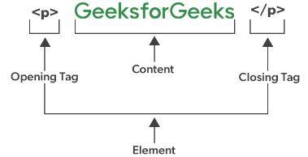

- [Basics](#basics)
- [HTML element](#html-element)


# Basics
- ## Introduction of HTML- 
   - HTML stands for ( Hyper Text Markup Language ).
   -  HTML is the standard markup language for creating Web pages. 
   -  HTML describes the structure of a Web page.
   -   HTML consists of a series of elements.
   -    It is used to structure a document into logical sections.
   - We use HTML elements to create all of the paragraphs, headings, lists, images, and links that make up a typical webpage.
   - With the help of HTML, we can embed content such as images and videos into a page.    

 - **Example** 
   ```html
    <!DOCTYPE html>
    <html>
        <head>
            <title>page title</title>
        </head>
        <body>
            <h1>heading</h1>
            <p>paragraph</p>
        </body>        
    </html>

- **Explanation**
   - The < !DOCTYPE html> declaration defines that this document is an HTML5 document.
   - The < html > element is the root element of an HTML page.
   - The < head> element contains meta information about the HTML page.
   - The < title> element specifies a title for the HTML page (which is shown in the browser's title bar or in the page's tab).
   - The < body> element defines the document's body, and is a container for all the visible contents, such as headings, paragraphs, images, hyperlinks, tables, lists, etc.
  - The < h1> element defines a large heading.
  - The < p> element defines a paragraph.

- **The < !DOCTYPE> Declaration**
    - The <!DOCTYPE> declaration represents the document type, and helps browsers to display web pages correctly.
   - It must only appear once, at the top of the page (before any HTML tags).
   - The <!DOCTYPE> declaration is not case sensitive.

- **HTML heading**
   - HTML headings are defined with the < h1> to < h6> tags.
   - < h1> defines the most important heading.
   - < h6> defines the least important heading:
     ```html
      <h1>this is heading 1</h1>
      <h2>this is heading 2</h2>
      <h3>this is heading 3</h3> 
- **HTML paragraph**
   - HTML paragraphs are defined with the <p> tag:
     ```html
     <p>this is paragraph</p>
     <p>this is another paragraph</p> 
<p align="right">(<a href="#top">˄</a>)

# HTML element
    - An HTML element is defined by a start tag, some content, and an end tag:
    -  Almost all elements on an HTML page are just pieces of content wrapped in opening and closing HTML tags.
    - Opening tags tell the browser this is the start of an HTML element. Closing tags tell the browser where an element ends. 
    


